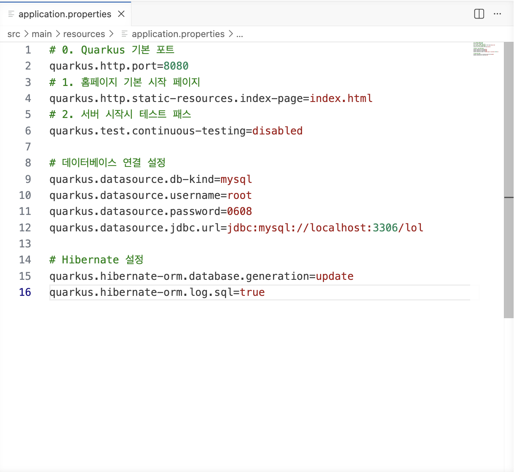

# 🎮 Quarkus Web Project 🎮
 
  

## 자바웹프로그래밍(1) 수업 실습 정리 💘
> 학번 : 20241400
> 이름 : 이서현

---

## project introduce 
Quarkus 기반 웹 프로그래밍 실습 프로젝트입니다. LOL 메인 화면 제작부터 로그인/회원가입 기능 구현까지 HTML, CSS, JavaScript, Bootstrap, Database 연동 등을 학습했습니다.

---
# 💗 Weekly Study Log

## 2~3주차 수업 내용
### 실습 1
#### 쿼스트 환경 구축 및 준비 완료!
- 실행 시 하단 터미널에 ./mvnw quarkus:dev 적기
- .properties에 메인 페이지 추가 후 저장하기

    

 

### 실습 2
- html 기본 및 lol 메인 화면 개발 완료!

### 응용 : LOL 메인화면 만들기

## 4주차 수업 내용
### 실습 1
- 부트스트랩 5 이해 및 활용
- 다양하게 네비바, css등 코드 확인
### 실습 2
- 네비바 및 하이퍼링크 만들기

## 5주차 수업 내용
실습 1: 모달창 구현하기
실습 2: 서브 페이지 추가하기
table 표 tr, th, td 항목으로 채워짐

## 6주차 수업 내용
실습1: js 파일로 별도 다운로드 후 연동하기
실습2: 자바 스크립트 1. 스코프 2. 재선언&재할당 3. 호이스팅 
실습3 : 외부 링크를 통해 검색 구현하기

## 7주차 수업 내용
### 실습1
- 실시간 챔피언 검색하기 - index.html 수정하기
사이드바 + 콘텐츠 + 뉴스 결과 출력
### 실습2 : search.js 자바스크립트 수정 
검색 키워드를 수정하여 가운데 출력될 수 있도록 하기 

## 9주차 수업 내용
### 실습1
- 다크모드 / 라이트모드 전환하기
 
-> 토글 버튼을 이용해서 버튼을 누르면 클릭 시에 토글 함수 호출하여 모드 전환
 
Toggle()gkatn : .toggle을 통해 css 일괄 적용
 
클릭에 따라 .light-mode 추가 및 제거
 
-> CSS에 테마 토글, 라이트 모드 코드 추가

    
    

 
- 네비바 기존 코드를 수정하여 마우스를 클릭하면 다크/라이트 모드가 자동전환됨

### 실습 2
- 자바 소스코드 위치 확인
 
-> @ 어노테이션 : Quarkus 전용

### 실습 3
- 데이터베이스 연동
 
-> 프로젝트 내부 의존성을 위해 pom.xml 파일에 코드 수정

    

 
-> DataSeeder.java 파일 작성하여 개발자 보드 확인하기

    

 

## 10주차 수업 내용
### 실습 1
- 9주차에 이어 데이터 베이스 연동
 
-> 만든 폴더 : champion.java / championResource.java / DataSeeder.java

### 실습2
- 로그인과 로그아웃
 
-> resource > login > login.html / main_after_login.html 파일 만들고
로그인 할 수 있는 html 작성 
dataseeder에 User 추가하려면 맨 위에 User 클래스인 import org.acme.login.User; 연동해야함

## 11주차 수업 내용
### 실습1
- 10주차에 이어 로그인과 로그아웃 만들기

### 실습2 : 회원가입
- login > login.html 수정하기
 
-> 회원가입 창 작성

    

 
-> 회원 테이블 수정 : User.java
- register.html 을 생성하여 아이디, 비밀번호, 이메일, 연락처 입력 후 회원가입하기

### 실습3 : 암호화
- SHA-256 : 256bit 해시 알고리즘
 
- 정상적으로 로그인하여 회원가입을 할 경우, dev-ui에 암호화된 해시가 남음

    

## 12주차 수업 내용
- 실습1: 로그인 - 암호화 체크(유효화 검사)
 
** 패스워드 - 해시값으로 수정해보기!
 
Mysql 클라이언트 접속 -> LOWER(password) WHERE username = 'guest’;
 
로그인 세션 후 대부분의 경로에 구현 필요!

## 13주차 수업 내용
- 실습1: 프로필 페이지 설정

    

 
** enctype="multipart/form-data" : 파일 전송 시 필수
 
** accept="image/*" : 이미피 파일만 선택 가능
 
** 이미지 업로드 후 profile에 사진 추가가 되는지 확인이 필요함
 

-실습2: 네비바의 사용자명 동적 표시
 
** main_after_login과 profile 수정함
 

    

